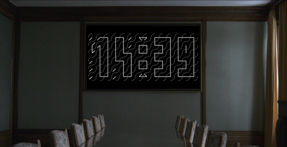

# ClockHandsDetection
Hypnosia is a young startup from the Business experience (BeX) program. The project consists of developing a prototype of a matrix display composed of watch movement (biaxial and triaxial), from the company SOPROD SA. With all the satisfying and relaxing animations proposed, the purpose of this product is to create emotions in anyone who looks at it.

## Description
This diploma work aims at the realization of a mobile application allowing to detect the position of the clock system using image processing. The purpose of this detection will be to carry out the initialization and calibration of the motors.

Indeed, because of the small motor’s sizes, there is no way to tell their positions for now. This is where this project come in. The goals are to detect and calibrate the clocks using a smartphone camera and image processing. And of course, the communication between both devices is going to be done with Bluetooth.

## Goals
*	Determination of the mobile platform to use (iOS or Android) and the framework choice (Dart, ObjectiveC, Kotlin…).
*	Handling of machine vision tools, in particular the OpenCV library.
*	Detection code of the Clock hands position with machine vision.
*	Bluetooth transmission of the hand’s positions.
*	Calibration code of the hands on mobile.
*	Depending on time, complete mobile application development for the clock’s animations.
